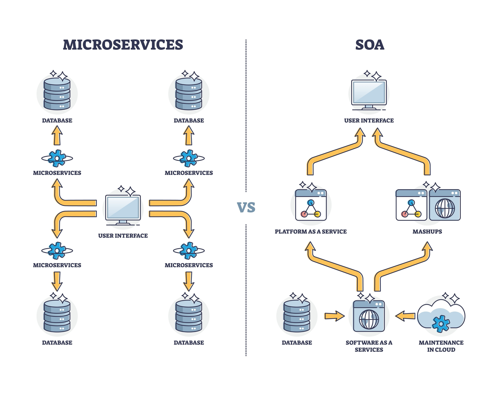

# Remitro Server

### 프로젝트 소개

Remitro Server는 온라인 뱅킹 서비스를 위한 마이크로서비스 기반 백엔드 시스템입니다. 계좌, 회원, 거래내역 등 독립적인 서비스로 구성되어 유연성과 확장성을 높였습니다.

---

### 아키텍처

* **마이크로서비스**: 각 비즈니스 도메인(회원, 계좌, 거래)이 독립적인 서비스로 분리되어 있습니다.
* **서비스 디스커버리**: 유레카 서버를 통해 각 서비스의 위치를 관리합니다.
* **API 게이트웨이**: 모든 외부 요청의 단일 진입점으로, 요청을 적절한 서비스로 라우팅합니다.

---

### 기술 스택

| 분류 | 기술 | 아이콘 |
|---|---|---|
| **백엔드** | Java 17 Spring Boot 3.x |   |
| **서비스 관리** | Spring Cloud Eureka Spring Cloud Gateway |   |
| **데이터베이스** | MySQL H2 (테스트용) |   |
| **API 문서화** | Swagger (OpenAPI 3.0) |  |
| **의존성 관리** | Gradle |  |

---

### 모듈 구조

* `remitro-common`: 여러 서비스에서 공유하는 공통 도메인 모델, 유틸리티, 예외 처리 등을 담고 있습니다.
* `remitro-config`: 중앙 집중식 설정을 관리하는 설정 서버입니다.
* `remitro-eureka-server`: 마이크로서비스의 위치를 등록하고 찾아주는 서비스 디스커버리 서버입니다.
* `remitro-api-gateway`: 모든 외부 요청의 단일 진입점으로, 인증 및 라우팅을 담당합니다.
* `remitro-member`: 회원가입, 로그인 등 회원 관련 비즈니스 로직을 처리하는 서비스입니다.
* `remitro-account`: 계좌 생성, 입출금, 송금 등 계좌 관련 비즈니스 로직을 처리하는 서비스입니다.
* `remitro-transaction`: 모든 거래내역을 기록하고 조회하는 서비스입니다.

---

### 실행 방법

1.  **Git 클론**: `git clone https://github.com/solmoonkang/remitro-server.git`
2.  **환경 설정**: `remitro-config` Git 저장소에 DB 연결 정보, 포트 등 환경 파일을 설정합니다.
3.  **서비스 실행**: 다음 순서대로 각 서비스를 실행합니다.
    * `remitro-eureka-server`
    * `remitro-config`
    * `remitro-api-gateway`
    * `remitro-member`
    * `remitro-account`
    * `remitro-transaction`

*(각 모듈 폴더에서 `./gradlew bootRun` 또는 IDE를 통해 실행)*

---

### API 문서

* **API 문서 URL**: `http://localhost:[API-Gateway-Port]/swagger-ui.html`
